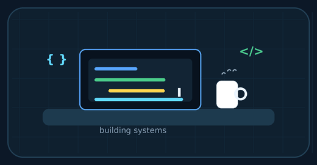
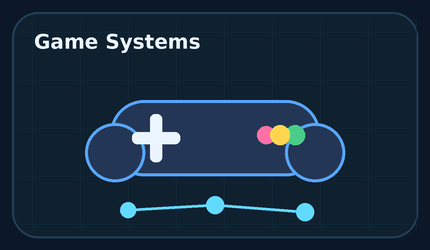
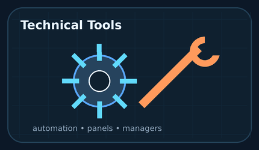
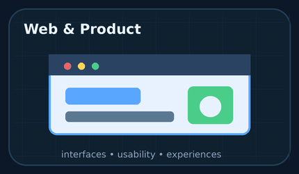
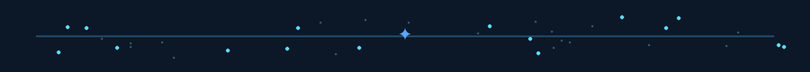
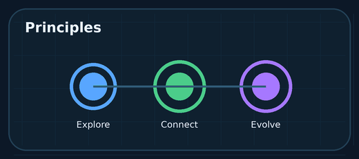
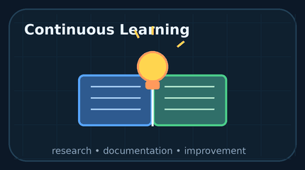
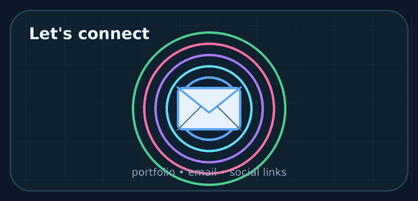

  🇺🇸 English |
  <a href="./README.pt-BR.md">🇧🇷 Português</a>

# 👋 Hi, I'm Ryan Lucas

### Exploring software, building complex systems and creating playable worlds.

 
 

 
 

## 🧠 About me

Hello, my name is Ryan Lucas. I am a Brazilian developer focused on games, software, and tools, driven by the curiosity to understand how things work beneath the surface.

For me, creating is not just about putting features together. It is about building systems with purpose, connection and real impact for the people who use them.

My passion for systems started when I was a child and got my first dinosaur toy. That sparked my interest in the ancient history of Earth, the species that once existed, their habitats, their origins and the way that world worked.

Over time, two other passions became part of my path: video games and astronomy. Through games, I discovered huge worlds beyond reality, filled with rules, possibilities and new experiences. Through astronomy, I found even more motivation to study, explore and understand the unknown.

As a teenager, I already knew the direction I wanted to follow. I wanted to become a game developer, because creating worlds, systems and experiences felt connected to who I was since childhood.

I started in this area at the age of 14, creating mods and tools for games. At 14, I created my first Minecraft mod. At 15, I developed my first mod for Ark Survival Evolved. At 16, I created my first electronic game.

Today, I keep studying, building and improving my skills, turning curiosity into real projects.

## 🌌 Origin

Before building a system, I try to understand the logic behind it.

I build systems because I like to understand how things work behind the curtain. To me, games, paleontology and astronomy carry the same question:

**What invisible forces make all of this exist?**

That curiosity is what guides the way I study, develop and transform ideas into functional projects.

## 🚀 Areas I explore

<table>
  <tr>
    <td align="center" width="33%">
      
      <h3>🎮 Game Systems</h3>
      
Gameplay mechanics, progression, materials, visual effects and rules for games and mods.

    </td>
    <td align="center" width="33%">
      
      <h3>🛠️ Technical Tools</h3>
      
Desktop applications, admin panels, automations and local management systems.

    </td>
    <td align="center" width="33%">
      
      <h3>🌐 Web and Product</h3>
      
Modern interfaces, interactive experiences and digital products focused on usability.

    </td>
  </tr>
</table>

  

## 🧰 Tools and technologies

### 🎮 Game Development

### 🎨 3D, textures and visual creation

### 💻 Software and technical tools

### 🖥️ Desktop, backend and data

### 🌐 Web and interfaces

### 🧪 Workflow

  

## 🧭 Principles

  

<table>
  <tr>
    <td width="33%">
      <h3>01 Explore</h3>
      
Understand and carefully study the environment before building the solution.

    </td>
    <td width="33%">
      <h3>02 Connect</h3>
      
Create systems where every piece has a reason to be there and to exist.

    </td>
    <td width="33%">
      <h3>03 Evolve</h3>
     
Continuously refine the project until it stops being just an idea and becomes an identity

    </td>
  </tr>
</table>

  

## 🎯 Current direction

 
 

| Area | Focus |
|---|---|
| 🎮 Engines | Unreal Engine, Unity, Godot, gameplay systems and interfaces |
| 🧠 Systems | Logic, architecture, automations and well-structured solutions |
| 🛠️ Tools | Desktop applications, admin panels and local management systems |
| 🌐 Web | Modern interfaces, digital products and interactive experiences |
| 🎨 Technical Art | Blender, materials, textures and asset preparation |
| 📚 Learning | Technical research, documentation and continuous improvement |

  

## 🌎 Languages

| Language | Level | Use |
|---|---|---|
| Portuguese | Native | Communication, projects and documentation |
| English | Intermediate | Technical reading, research, documentation and business |

---

## 📫 Contact

 
 

---

  My portfolio for those who want to know more about my projects.

